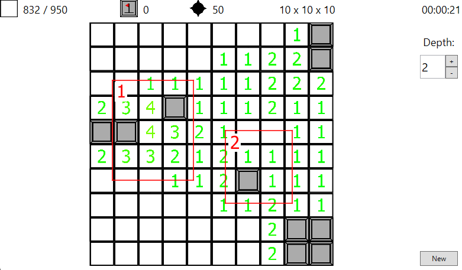

# Minesweeper 3D

## Introduction
Minesweeper 3D is, as the name suggests, a Minesweeper, but in 3 dimensions.

## Contents of this repository

The "Library" folder contains a library used to implement the logic of a 3D minesweeper game.
The "GUI - WPF" folder contains a Windows Presentation Foundation based GUI for a 3D minesweeper game.

## Concept demonstration



- In highlighted box **1**, you can notice a tile with 4 surrounding mines, despite it having only 2 neighboring uncovered tiles, that is because the surrounding mines can be on tiles above or below this tile as well.
- In highlighted box **2**, you can notice a single uncovered tile with "1" tiles surrounding it. This is normally an indication of a mine in that tile, however, since we're in 3D, the mine can actually be in the layer above or below the current one.

## License
This program is published under the **Mozilla Public License v2**.
Everyone is free to use and distribute this program, modify it's source code and distribute the modified versions under the terms of this license.
For more information about the Mozilla Public License, you can read the LICENSE.md file that should be present in the root directory of this program.
Alternatively you can get a summary of this license, including it's full text at [choosealicense.com](https://choosealicense.com/licenses/mpl-2.0/)

## Source code
The source code for this program is available at a GitHub repository at [github.com/VojtechKursa/Minesweeper3D](https://github.com/VojtechKursa/Minesweeper3D).

## Building

### Visual Studio

Open the .sln file at the root of this repository using Visual Studio and start a build.
Alternatively you can download a pre-built release version in the **Releases** section of the GitHub repository [here](https://github.com/VojtechKursa/Minesweeper3D/releases).

### .NET CLI

Run the following command at the root of the repository:

```sh
dotnet build
```
